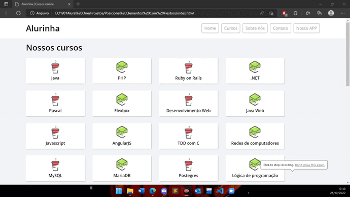

<h1 align="center"> CSS Grid Layout 💻 </h1>
  

  
  

Releitura do site desenvolvido durante os cursos de **HTML5 e CSS3** da ALURA.  Projeto construído para fins didáticos, com o objetivo de colocar em prática os conhecimentos de HTML e CSS.

 

<h2 align="center"> Propostas do curso</h2

* Aprender a famosa `especificação flexible box para posicionar seus elementos` na página.
* Entender as `diversas propriedades do flexbox` e como usá-las.
* Entender como as propriedades do `flexbox substituem float, inline e inline-block`.
* Criar um site responsivo com flexbox.

<h3 align="center">👩🏽‍💻 Tecnologias Utilizadas</h3>   

* HTML;
* CSS.
